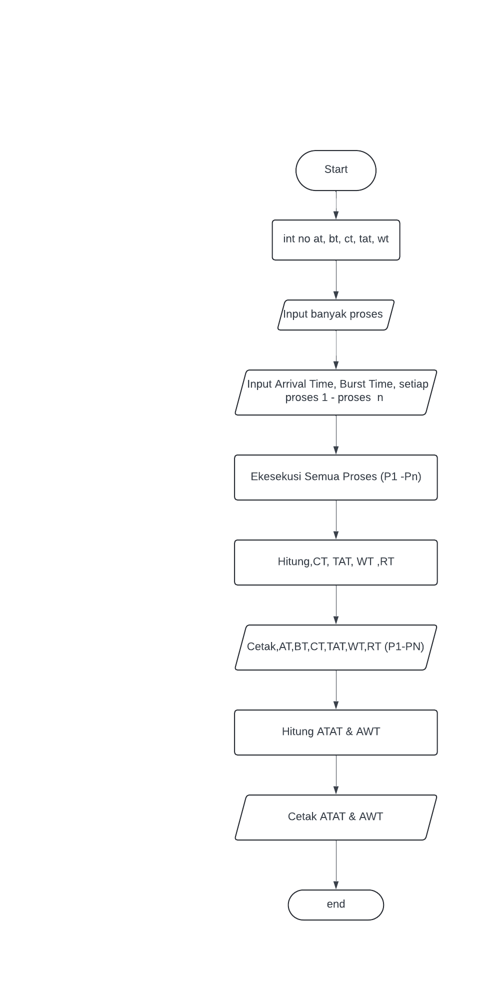
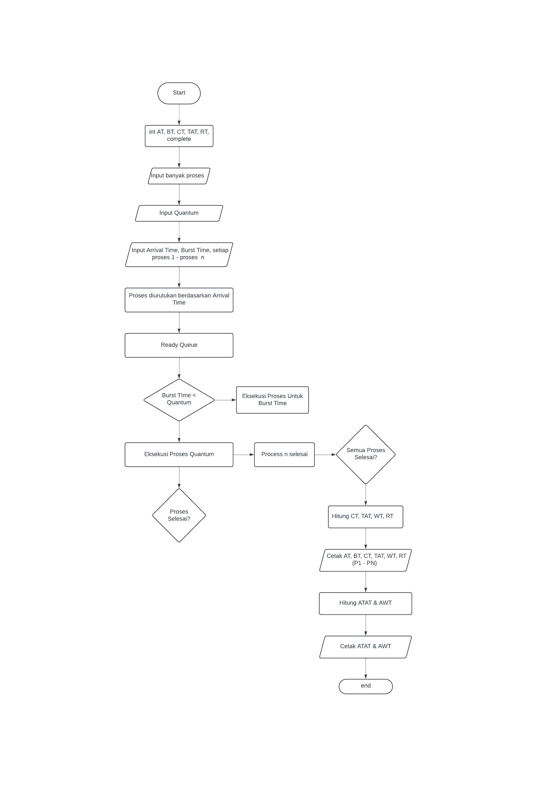

  <h1 style="text-align: center;font-weight: bold">Praktikum 11 Praktek Sistem Operasi</h1>
  <h4 style="text-align: center;">Dosen Pengampu : Dr. Ferry Astika Saputra, S.T., M.Sc.</h4>

 

  
  <h3 style="text-align: center;">Disusun Oleh : </h3>
  

    <strong>Muhammad Yafi Rifdah Zayyan (3123500001) </strong> 
    <strong>Muhammad Daffa Erfiansyah (3123500006) </strong> 
    <strong>Maula Shahihah Nur Sa'adah (3123500008)</strong>
  

<h3 style="text-align: center;line-height: 1.5">Politeknik Elektronika Negeri Surabaya Departemen Teknik Informatika Dan Komputer Program Studi Teknik Informatika 2023/2024</h3>
  

  <h1 class="text-align: center;font-weight: bold">Praktikum 10 Sistem Operasi</h1>
  <h3 class="text-align: center;">Dosen Pengampu : Dr. Ferry Astika Saputra, S.T., M.Sc.</h3>

 

  
  <h3 style="text-align: center;">Disusun Oleh :  Kelompok 4</h3>
  

    <strong>Muhammad Yafi Rifdah Zayyan (3123500001)</strong> 
    <strong>Muhammad Daffa Erfiansyah (3123500006)</strong> 
    <strong>Maula Shahihah Nur Sa'adah (3123500008)</strong>
  

<h3 style="text-align: center;line-height: 1.5">Politeknik Elektronika Negeri Surabaya Departemen Teknik Informatika Dan Komputer Program Studi Teknik Informatika 2023/2024</h3>
  

# Scheduling Algorithms
Algoritma penjadwalan sangat penting dalam sistem operasi untuk mengelola proses secara optimal, baik dalam penggunaan CPU maupun sumber daya lainnya. Algoritma ini menentukan urutan eksekusi proses untuk meningkatkan kinerja sistem, meminimalkan waktu tunggu, dan memastikan keadilan antar proses. Ada beberapa jenis algoritma penjadwalan, masing-masing dengan metode unik untuk memprioritaskan tugas. Salah satu algoritma penjadwalan yang paling sederhana dan sering digunakan adalah algoritma penjadwalan First-Come, First-Served (FCFS).

##  Scheduling Algoritma FCFS

**First-Come, First-Served (FCFS)** adalah algoritma penjadwalan paling sederhana. Dalam algoritma ini, proses dieksekusi sesuai dengan urutan kedatangan mereka dalam antrian siap. Proses yang tiba pertama kali akan dieksekusi terlebih dahulu, dan seterusnya. Pendekatan ini mirip dengan cara orang dilayani dalam antrian di loket layanan.

### Karakteristik FCFS

- **Non-preemptive:** Setelah proses mulai dieksekusi, proses tersebut akan berjalan sampai selesai tanpa terganggu.
- **Mudah diimplementasikan:** Algoritma FCFS mudah dipahami dan diimplementasikan karena hanya memerlukan struktur antrian dasar.
- **Adil dalam hal waktu kedatangan:** Setiap proses mendapatkan kesempatan untuk dieksekusi sesuai urutan kedatangannya, memastikan tidak ada proses yang kelaparan.

### Keuntungan

- **Sederhana:** Mudah diimplementasikan dan dipahami.
- **Adil:** Memastikan bahwa proses dieksekusi sesuai urutan kedatangan.

### Kelemahan

- **Efek Konvoi:** Proses-proses pendek mungkin harus menunggu proses-proses panjang untuk selesai, yang menyebabkan peningkatan waktu tunggu rata-rata dan menurunkan efisiensi sistem.
- **Tidak Ideal untuk Sistem Berbagi Waktu:** Tidak adanya preemption dapat menyebabkan kinerja yang buruk pada sistem yang memerlukan waktu respons cepat.

### FCSS Scheduling Algorithms
 

### Analisis Algoritma FCFS (First-Come-First-Served) Tanpa Arrival Time

**Kelebihan:**
- **Sederhana:** Algoritma FCFS adalah salah satu yang paling sederhana dalam penjadwalan proses.
- **Mudah diimplementasikan:** Programnya relatif mudah dipahami dan diimplementasikan.
- **Adil:** Setiap proses diproses sesuai dengan urutannya.

**Kekurangan:**
- **Waiting Time (WT) yang tinggi:** Algoritma ini dapat menghasilkan waktu tunggu yang tinggi untuk proses yang tiba setelah proses-proses lain yang memakan waktu lama sudah mulai dieksekusi.
- **Ketidakmampuan memprioritaskan:** FCFS tidak memprioritaskan proses berdasarkan jenis atau urgensi, yang bisa menjadi masalah dalam kasus di mana beberapa proses lebih penting daripada yang lain.

**Performa dan Efisiensi:**
- Performa algoritma ini dapat bervariasi tergantung pada distribusi waktu burst dan jumlah proses.
- Algoritma ini cocok untuk kasus di mana waktu burst terdistribusi secara merata antara proses-proses atau jika tidak ada perbedaan signifikan dalam waktu burst antara proses-proses.

**Perbaikan yang Mungkin Dilakukan:**
- Untuk mengatasi masalah waiting time yang tinggi, bisa digunakan strategi penjadwalan yang lebih canggih seperti Shortest Job Next (SJN) atau Round Robin (RR), tergantung pada kebutuhan dan karakteristik sistem.

Algoritma FCFS tanpa waktu kedatangan adalah pilihan yang baik dalam kasus-kasus sederhana atau di mana urutan kedatangan adalah faktor penentu utama. Namun, dalam situasi di mana waktu burst proses bervariasi secara signifikan atau ketepatan waktu eksekusi menjadi kritis, FCFS tanpa waktu kedatangan mungkin tidak menjadi pilihan terbaik.

## Non-Preemptive Priority Scheduling (Highest Priority First) Algorithms

Algoritma penjadwalan Non-Preemptive Priority Scheduling, juga dikenal sebagai Highest Priority First (HPF), adalah salah satu algoritma penjadwalan yang memprioritaskan proses berdasarkan tingkat prioritasnya. Dalam algoritma ini, setiap proses memiliki prioritas yang ditetapkan, dan proses dengan prioritas tertinggi dieksekusi terlebih dahulu. Algoritma HPF adalah non-preemptive, yang berarti setelah sebuah proses mulai dieksekusi, proses tersebut akan berjalan sampai selesai atau ada proses dengan prioritas yang lebih tinggi masuk.

### Karakteristik HPF:

- **Prioritas Proses:** Setiap proses diberi prioritas tertentu, yang menentukan urutan eksekusi.
- **Non-Preemptive:** Proses yang telah dimulai tidak akan diinterupsi kecuali ada proses dengan prioritas yang lebih tinggi.
- **Sederhana dan Efektif:** Algoritma HPF relatif mudah dipahami dan diimplementasikan, serta efektif dalam mengatur eksekusi proses sesuai dengan prioritasnya.

### Keuntungan:

- **Kepentingan Tertinggi Didahulukan:** Memastikan bahwa proses-proses yang memiliki kepentingan tinggi dieksekusi lebih dahulu, yang penting dalam lingkungan di mana respons cepat diperlukan.
- **Sederhana:** Algoritma HPF relatif sederhana dan mudah diimplementasikan.

### Kelemahan:

- **Potensi Inversi Prioritas:** Proses-proses dengan prioritas rendah dapat terjebak dalam inversi prioritas jika ada proses dengan prioritas lebih tinggi yang membutuhkan sumber daya yang sama.
- **Ketidakadilan:** Proses dengan prioritas rendah dapat mengalami starvation jika terlalu banyak proses dengan prioritas lebih tinggi.

### Flowchart

### Analisis:

Algoritma HPF sangat cocok untuk lingkungan di mana ada kebutuhan untuk menangani proses-proses dengan prioritas yang berbeda secara efektif, seperti dalam sistem real-time di mana respons cepat sangat penting. Namun, perlu diingat bahwa penggunaan algoritma ini dapat menghasilkan efek inversi prioritas di mana proses dengan prioritas rendah terhalang oleh proses dengan prioritas lebih tinggi yang membutuhkan sumber daya yang sama. Oleh karena itu, perlu perhatian khusus dalam merancang sistem agar menghindari potensi ketidakadilan dan memastikan bahwa proses-proses dengan prioritas rendah tetap mendapatkan kesempatan untuk dieksekusi.

## Round Robin Scheduling Algorithms

Algoritma Penjadwalan Round Robin adalah salah satu pendekatan yang paling umum digunakan dalam sistem operasi untuk mengalokasikan sumber daya CPU kepada proses yang berjalan. Dalam algoritma ini, setiap proses diberikan sejumlah waktu CPU yang tetap atau disebut sebagai quantum. Proses kemudian dieksekusi selama quantum waktu tersebut, dan jika proses belum selesai, ia akan dipindahkan ke belakang dalam antrian dan proses berikutnya akan dieksekusi. Proses yang belum selesai akan kembali dieksekusi saat giliran mereka tiba.

### Karakteristik Round Robin:

- **Quantum Time:** Setiap proses diberikan sejumlah waktu CPU yang tetap atau disebut sebagai quantum untuk dieksekusi.
- **Preemptive:** Algoritma ini bersifat preemptive, artinya jika sebuah proses belum selesai dalam quantum waktu, ia akan dipindahkan ke belakang dalam antrian.
- **FIFO Queue:** Proses disimpan dalam antrian FIFO (First-In-First-Out), dengan proses yang tiba lebih awal memiliki prioritas eksekusi yang lebih tinggi.

### Keuntungan:

- **Keadilan:** Algoritma Round Robin memastikan bahwa setiap proses mendapatkan sejumlah waktu CPU yang adil untuk dieksekusi, mencegah proses tertentu menguasai CPU secara terus-menerus.
- **Responsif:** Algoritma ini cocok untuk lingkungan di mana respon cepat terhadap permintaan proses adalah penting.

### Kelemahan:

- **Overhead Context Switching:** Jika quantum terlalu kecil, maka terjadi overhead dari beralih konteks yang berlebihan.
- **Waktu Tunggu Rata-rata Tinggi:** Proses-proses pendek mungkin harus menunggu giliran mereka dalam antrian, yang dapat meningkatkan waktu tunggu rata-rata.

### Flowchart

### Analisis:

Algoritma Round Robin cocok untuk lingkungan di mana tidak ada prioritas yang jelas di antara proses-proses yang dieksekusi dan di mana respons cepat terhadap permintaan proses adalah kunci. Namun, ukuran quantum yang tepat harus dipilih dengan hati-hati untuk memastikan keseimbangan antara responsifitas sistem dan overhead beralih konteks. Algoritma ini juga tidak cocok untuk sistem real-time yang memerlukan waktu respons yang sangat singkat, karena proses-proses dengan waktu eksekusi yang panjang dapat memblokir proses-proses dengan waktu eksekusi yang pendek dalam antrian.

