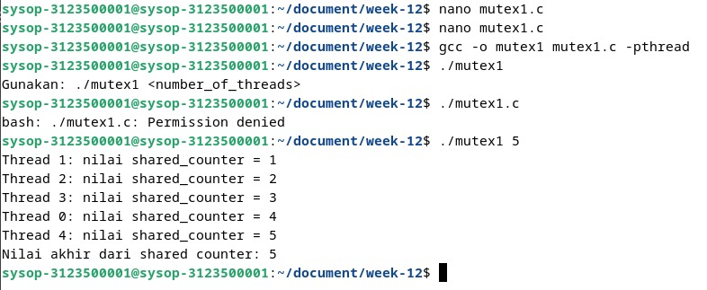
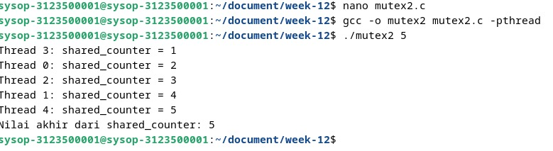

<div align="center">
  <h1 style="text-align: center;font-weight: bold">Praktikum 12<br>Praktek Sistem Operasi</h1>
  <h4 style="text-align: center;">Dosen Pengampu : Dr. Ferry Astika Saputra, S.T., M.Sc.</h4>
</div>
<br />
<div align="center">
  
  <h3 style="text-align: center;">Disusun Oleh : </h3>
  <p style="text-align: center;">
    <strong>Muhammad Yafi Rifdah Zayyan (3123500001) </strong><br>
    <strong>Muhammad Daffa Erfiansyah (3123500006) </strong><br>
    <strong>Maula Shahihah Nur Sa'adah (3123500008)</strong>
  </p>
<h3 style="text-align: center;line-height: 1.5">Politeknik Elektronika Negeri Surabaya<br>Departemen Teknik Informatika Dan Komputer<br>Program Studi Teknik Informatika<br>2023/2024</h3>
  <hr><hr>
</div>

# Pemahaman Mutex Dalam Pemrograman Multithreading

## Penjelasan Mutex

Mutex (Mutual Exclusion) adalah sebuah mekanisme yang digunakan dalam pemrograman multithreading untuk mengontrol akses ke sumber daya bersama oleh beberapa thread secara eksklusif. Saat suatu thread mengunci mutex, thread lain harus menunggu hingga mutex dibuka kembali sebelum dapat mengakses sumber daya yang sama. Ini membantu mencegah kondisi balapan (race conditions) di mana beberapa thread mencoba mengubah sumber daya bersama secara bersamaan.

## Kode Program Non-Mutex

**Berikut adalah contoh sederhana penggunaan multithreading non-mutex:**

```c
#include <pthread.h>
#include <stdio.h>
#include <stdlib.h>

int shared_counter = 0;

void *thread_function(void *thread_id)
{         
    pthread_t tid = (pthread_t)thread_id;

    shared_counter++;         
                
    printf("Thread %ld: nilai shared_counter = %d\n", 
    (long)tid, shared_counter);

    return NULL;
}              

int main(int argc, char *argv[])
{
               
    if (argc != 2)
    {
        printf("Gunakan: %s <number_of_threads>\n", 
        argv[0]);
        exit(EXIT_FAILURE);
    }
                
    int num_threads = atoi(argv[1]);

    pthread_t *threads = (pthread_t *)malloc(
    num_threads * sizeof(pthread_t));         
               
    for (int i = 0; i < num_threads; i++)
    {
              
        int status = pthread_create(&threads[i], NULL,
        thread_function, (void *)threads[i]);
                                                
        if (status != 0)
        {
            printf("Error: pthread_create() returned error"
            "code %d\n", status);
                                        
            exit(EXIT_FAILURE);           
        }
    }

    for (int i = 0; i < num_threads; i++)
    {
        int status = pthread_join(threads[i], NULL);
        if (status != 0)
        {
            printf("Error: pthread_join() returned error "
            "code %d\n", status);
            exit(EXIT_FAILURE);                     
        }
    }

    free(threads);
                
    printf("Nilai akhir dari shared counter: %d\n",
    shared_counter);

    return 0;
}
```
### Contoh Implemenasi Non-Mutex Pada Debian 


### Analisa Program
Dalam kode program di atas, tidak ada penggunaan mutex untuk melindungi variabel `shared_counter`. Akibatnya, beberapa thread dapat mengakses dan memodifikasi variabel `shared_counter` secara bersamaan, menghasilkan hasil yang tidak terduga dan tidak konsisten. Kondisi balapan dapat terjadi ketika dua atau lebih thread mencoba mengubah nilai `shared_counter` pada saat yang bersamaan.

### Kesimpulan Program
Penggunaan mutex sangat penting dalam pemrograman multithreading untuk memastikan akses yang aman dan koheren ke sumber daya bersama. Tanpa pengamanan mutex, kondisi balapan dapat terjadi, mengakibatkan hasil yang tidak dapat diprediksi dan mungkin menyebabkan kesalahan atau kerusakan pada program. Dengan menggunakan mutex, kita dapat memastikan bahwa hanya satu thread yang dapat mengakses sumber daya bersama pada satu waktu, sehingga meningkatkan keandalan dan kestabilan program multithreading.

### Kode Program  Menggunakan Mutex
**contoh kode program menggunakan mutex**

```c
#include <pthread.h>
#include <stdio.h>
#include <stdlib.h>

int shared_counter = 0;
pthread_mutex_t shared_counter_mutex = PTHREAD_MUTEX_INITIALIZER;

void *thread_function(void *thread_id) 
{
    long tid = (long)thread_id;

    pthread_mutex_lock(&shared_counter_mutex);

    shared_counter++;

    printf("Thread %ld: shared_counter = %d\n", tid, shared_counter);

    pthread_mutex_unlock(&shared_counter_mutex);

    return NULL;
}

int main(int argc, char *argv[]) 
{
    if (argc != 2) {
        printf("Penggunaan %s <number_of_threads>\n", argv[0]);
        exit(EXIT_FAILURE);
    }

    int num_threads = atoi(argv[1]);

    pthread_t *threads = (pthread_t *)malloc(num_threads * sizeof(pthread_t));

    if (threads == NULL) {
        printf("Error: Gagal mengalokasikan memori untuk threads\n");
        exit(EXIT_FAILURE);
    }

    for (long i = 0; i < num_threads; i++) 
    {
        int status = pthread_create(&threads[i], NULL, thread_function, (void *)i);
        if (status != 0) 
        {
            printf("Error: pthread_create() mengembalikan kode error %d\n", status);
            exit(EXIT_FAILURE);
        }
    }

    for (int i = 0; i < num_threads; i++) {
        int status = pthread_join(threads[i], NULL);
        if (status != 0) 
        {
            printf("Error: pthread_join() mengembalikan kode error %d\n", status);
            exit(EXIT_FAILURE);
        }
    }

    free(threads);

    printf("Nilai akhir dari shared_counter: %d\n", shared_counter);

    return 0;
}
```


### Contoh Implementasi Mutex Pada Debian


### Analisa
Penggunaan mutex dalam program ini memberikan keamanan terhadap akses konkuren ke variabel bersama `shared_counter`. Dengan mengunci mutex sebelum mengakses `shared_counter` dan membuka kunci setelah selesai, program memastikan bahwa hanya satu thread yang dapat mengakses variabel tersebut pada satu waktu. Hal ini menghindari kondisi balapan `(race conditions)` yang dapat terjadi jika beberapa thread mencoba mengubah nilai `shared_counter` secara bersamaan tanpa koordinasi.

### Kesimpulan Program
Penggunaan mutex dalam pemrograman multithreading sangat penting untuk memastikan keamanan dan koherensi akses ke sumber daya bersama. Dalam program ini, mutex digunakan untuk melindungi variabel `shared_counter` dari akses konkuren oleh beberapa thread, sehingga meningkatkan keandalan dan stabilitas program. Dengan menggunakan mutex, program dapat berjalan secara benar dan dapat diandalkan dalam lingkungan multithreading.

